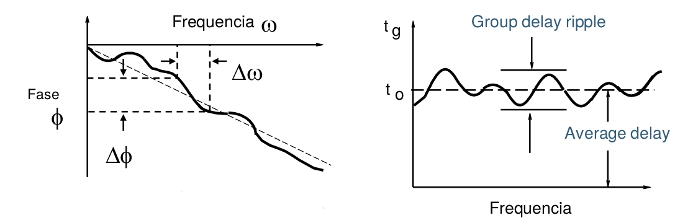
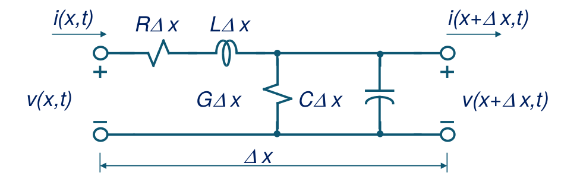
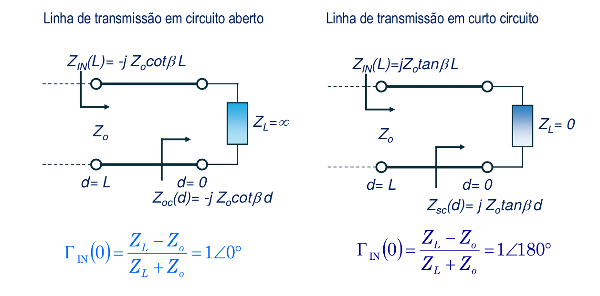
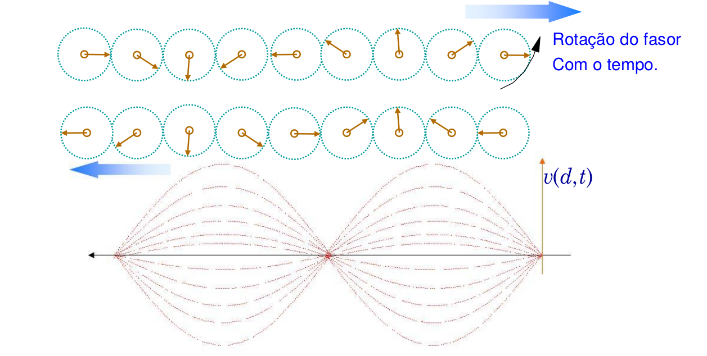
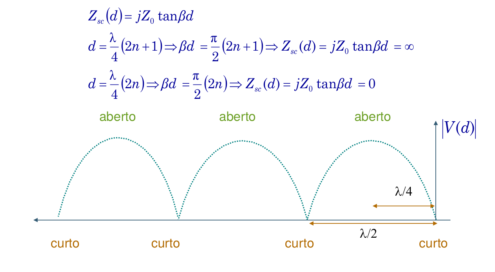
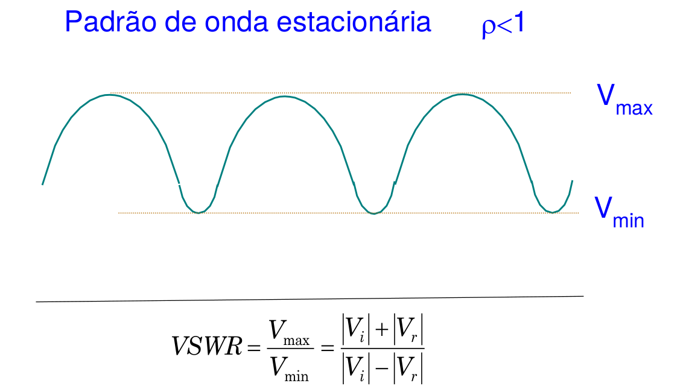

# Linhas e Transmissão

Métrica da linha                           Expressão                                                                                                                     Simplificação
-----------------------------   ---------------------------------------------------------------------------------------------------------------------------   ---------------------------------------------
Onda de tensão                     $V(x) = Ae^{-\gamma x} + Be^{\gamma x}$
Onda de corrente                   $I(x) = \frac{A}{Z_0}e^{-\gamma x} + \frac{B}{Z_0}e^{\gamma x}$
Impedância característica          $Z_0 = \sqrt{\frac{R + j\omega L}{G + j\omega C}}$                                                                           $R = 0, G = 0 \implies Z_0 = \frac{L}{C}$
Constante de propagação            $\gamma = \alpha + j\beta$
Coeficiente de ...                 $\Gamma = \frac{Be^{j\gamma x}}{Ae^{-\gamma x}} = \frac{B}{a}e^{2\gamma x}$                                                  $\Gamma(x) = \Gamma_0 e^{2\gamma x} = \Gamma (0)e^{2\gamma x}$ 
Impedância de entrada              $Z_{IN}(x) = \frac{V(x)}{I(x)} = Z_0 \frac{e^{\gamma x} + \Gamma_0 e^{\gamma x}}{e^{\gamma x} - \Gamma_0 e^{\gamma x}}$      $Z_{IN}(0) = Z_L = Z_0 \frac{1 + \Gamma_0}{1 - \Gamma_0}$ 
Coeficiente de ...                 $\Gamma_0 = \frac{Z_L - Z_0}{Z_L + Z_0}$

Em grande parte da cadeira vamos assumir que não existe atenuação

Exemplos de linhas de transmissão:

- Bifilar
- Coplanar
- Coaxial
- Microstrip

# Microondas
- frequência(f): 1 GHz $\approx$ 300 GHz
- comprimento de onda($\lambda$): 30 cm $\approx$ 1 mm

# Radiofrequência (RF)
- Em RF usam-se fontes de potência
- Se tiver uma fonte de tensão, determino a potência pela resistência interna da fonte
- A RF não uso resistências porque não quero dissipar energia
- Os cabos não são meros fios de ligação:
	- possuem uma determinada resistividade $\implies$ ressitência parasita
	- Sofrem de efeito indutivo
	- e efeito capacitivo
	- Também é preciso ter em consideração a disrupção do dielétrico
	- Os circuitos têm **sempre** de ser vistos como **modelos de elementos distribuidos**
	- OS parâmetros passam a ser distribuidos pela linha
		- R/m
		- C/m
		- L/m
		- G/m

Valores típicos de linhas $Z_0$: 

- $75 \Omega$ - antenas de televisão
- $50 \Omega$ - material de laboratório

A impedância característica do ar é $Z_{0_{ar}} = 120 \pi$

# Efeito Pelicular
À medida que a frequência aumenta a zona do metal onde se propaga a corrente diminui. Este fenómeno ocorre devido ao efeito de autoindução do metal, no qual o campo magnético no seu interior se cancela, aumentando, fazendo que a onda de corrente circule preferencialmente na periferia, criando uma distribuição não-uniforme da densidade de corrente ao longo do condutor

$$\delta = \frac{1}{2\pi}\sqrt{\frac{\rho}{f\mu_r}}$$

Para evitar, devo libertar dos elementos discretos sempre que possível. Limites:

- Resistências _through hole_: 10 MHZ máx
- Resistências SMD  1 GHz máx
	- 0.8, 0.5
	- 0.6, 0.3

# Componentes Passivos a altas frequências
Devido aos parasitas presentes nos componentes discretos, para altas frequência estes de se comportar como se comportavam para baixas frequências e DC.

## Resistências
- Deixam de seguir a lei de Ohm
- Possuem condensadores em paralelo e bobines em série para representar as indutâncias e capacidades parasitas resultantes da sua construção

 
## Bobines
- O modelo equivalente é uma bobine com uma resistência em série, em paralelo com um condensador
- Para uma dada frequência o circuito RLC formado com a indutância e capacidade parasita possui um máximo $\implies$ **frequência de ressonância**
	$$f_R = \frac{1}{2\pi \sqrt{LC}}$$
	- Onde L é dado por:
	$$L = \frac{r^2n^2}{22.9l + 25.4r} (\mu H)$$
	- e onde:
		- `r`: raio da bobine (cm)
		- `l`: comprimento da bobine (cm)
		- `n`: número de voltas da bobine 
- O fator de qualidade do filtro produzido pode ser dado por $Q = \frac{X_L}{R} = \frac{2\pi f_R L}{R} = \frac{1}{R}\sqrt{\frac{L}{C}}$, onde $X_L$ é a reatância do condensador
- Para frequências superiores à frequência de ressonância, a capacidade parasita domina e a bobine passa a ter comportamento capacitivo

	
## Condensadores
- Para altas frequências, um condensador pode ser descrito por um circuito RLC série.
- A frequência de ressonância é dada por:
	$$f_R = \frac{1}{2\pi \sqrt{LC}}$$
	- Onde a capacidade de um condensador de placas paralelas é dada por:
	$$C=\frac{\epsilon_{dielectric}A}{d}$$
	- `A`: área da superfície sobreposta
	- `d`: distância entre as placas
- O fator de qualidade do filtro produzido pode ser dado por $Q = \frac{X_C}{R} = \frac{1}{2\pi f_R RC} = \frac{1}{R}\sqrt{\frac{L}{C}}$, onde $X_C$ é a reatância do condensador
- Para frequências superiores à frequência de ressonância, a indutância parasita domina e o condensador passa a ter comportamento indutivo

# Linhas de transmissão
- bifilares
- coaxiais
- **microstrip**[^1]
- **coplanares**[^1]

[^1]: Podem ser feitos em PCB. São as mais usadas para alta-frequência

Linhas de transmissão são guias de onda em fios/pista de cobre.

# Analogia com a Luz
Tal como a luz, também as ondas de radiofrequência sofrem:

- reflexão
- transmissão

Existe a noção em RF de:

- Onda incidente
- Onda refletida
- Onda transmitida

DUT: Device Under Test

- A $\leftarrow$ tensão inciddente num porto
- B $\leftarrow$ tensão refletida num porto

## Reflexão
- **VSWR:** Voltage Stationary Wave Ratio - $$VSWR = \frac{E_{max}}{E_{min}} = \frac{1 + \rho}{1 - \rho}$$
- **Parâmetros S:** $S_{11}$ e $S_{22}$
- **Coeficiente de Reflexão:** G, r
	- $\tau = \frac{V_{refletido}}{V_{Incidente}} = \frac{B}{A} = \rho < \Theta = \frac{Z_L - Z_0}{Z_L + Z_0}$$
- **Return Loss:** $RL = -20log_{10}(\rho) \implies \rho = |\Tau|$
- **Impedância/Admitância:** $R + jx$/$G + jB$
- **Perdas**

                   Sem reflexões           Reflexão $(ZL_{aberto}, ZL_{fechado}$
----------------- ----------------  -----------------------------------------------
$\rho$                 0                         1
$RL$                 $\infty dB$                     $0 dB$
$VSWR$                     1                         $\infty$

## Transmissão
- **Ganho/Perdas:** $G = 20 log_{10}|\frac{V_{Transmitida}}{V_{Incidente}} = 20 log(\tau)$
- **Parâmetros S:** $S_{21}$ e $S_{12}$
- **Coeficiente de Transmissão:** T, t
	- $\frac{V_{transmitida}}{V_{incidente}} = \frac{T}{A} = \tau \angle \phi$
- **Insertion Loss:**
	- $L = -20 log_{10}|\frac{V_{Transmitida}}{V_{Incidente}} = -20 log(\tau)$
- **Insertion Phase:**
	- $\angle (\frac{V_{Transmitida}}{V_{Incidente}} = \phi$
- **Variação de fase:**
- **Atraso de Grupo**
	- Variação do atraso que um sistema coloca num sinal, para cada frequência
	- Se o atraso de grupo não for nulo, isso significa que o mesmo sistema para componentes de um sinal a diferentes frequências, atrasa-as de forma diferente, destroindo a envolvente do sinal
	- $$\frac{-d \phi}{d \omega} = \frac{-1}{360 \degree} \times \frac{d \phi}{d f}$$

Se onda for transmitida mas a antena partir-se, a potência é refeltida e quaim-se o amplificador
Colocam-se várias mecanismos de proteção, como atenuadores no caminho para trás
VSWR = E_{max}

Desenhar um filtro implica ter um comportamento de perdas por inserção a uma dada frequência

# Linhas de transmissão

- A impedância do meio/linha ($Z_0$) é constante na frequência para alta frequência.
Uma linha de transmissão segue um modelo de parâmetros distribuídos, porque para a sua frequência de operação os vários pontos da linha estão em fases diferentes da onda, existindo vários períodos da onda dentro da linha
- $R \Delta x$: resistividade da linha por metro. Existe porque as linhas de transmissão são feitas de material resistivo
- $L \Delta x$: indutância da linha por metro. Existe indutância porque tenho corrente a circula rna linha
- $C \Delta x$: capacidade. Existem capacidades entre o ground e a tensão de alimentação
- $ G \Delta x$
	- Existe uma tensão de disrupção do dielétrico para prevenir descargas e isolar os dois cabos da linha

# Equação dos telegrafistas
Impedância Característica:

$$v(x, t) - v(x + \Delta x, t) = R \Delta x \cdot i(x.t) + L \Delta x \cdot \frac{\delta i(x,t)}{\delta t}$$
$$ \frac{v(x + \Delta x,t) - v(x, t)}{\Delta x} = - R\cdot i(x,t) - L \cdot \frac{\delta i(x,t)}{\delta t}$$
$$\frac{\delta v(x, t)}{\delta x} = - R \cdot i(x, t) - L \cdot \frac{\delta i(x, t)}{\delta t}$$

$$\begin{cases} \frac{\delta v(x, t)}{\delta x} = - R \cdot i(x, t) - L \cdot \frac{\delta i(x, t)}{\delta t} \\ \frac{\delta v(x, t)}{\delta x} = - R \cdot i(x, t) - L \cdot \frac{\delta i(x, t)}{\delta t} \end{cases}$$

De onde se obtém que:

$$\begin{cases} \textbf{V}(x) \equiv f(x) e^{j\phi(x)} \\ \textbf{I}(x) \equiv g(x) e^{j\nu(x)} \end{cases}$$
$$\begin{cases} v(x, t) = Re[V(x)e^{j\omega t}] \\ i(x, t) = Re[I(x)e^{j\omega t}] \end{cases} \implies \begin{cases} \frac{dV(x)}{dx} = - (R + j\omega L) I(x) \\ \frac{dI(x)}{dx} = - (G + j\omega C) V(x) \end{cases} $$

$\alpha$: constante de atenuação
$\beta$: constante de fase

$$ \frac{d^2 V(x)}{dx^2} - \gamma^2 V(x) = 0 $$

$$\gamma = \sqrt{(R + j\omega L) (G + j \omega C)} = \alpha + j\beta$$

Duas ondas:

- onda incidente, A
- onda refletida, B

$$\implies \begin{cases} V(x) = Ae^{-\gamma x} + Be^{\gamma x} \\ I(x) = \frac{A}{Z_0}e^{-\gamma x} - \frac{B}{Z_0} e^{\gamma x} \end{cases} $$

O que nos permite escrever a impedância característica como:

$$Z_0 = \sqrt{\frac{R + j \omega L}{G + j\omega C}}$$

## Linhas sem perdas
- $R = G = 0$
- $\gamma = j \omega \sqrt{LC} = j\beta$

$$v(x, t) = Re [V(x) e^{j \omega t}] = Re[Ae^{-j(\beta x - \omega t}+ Be^{j(\beta x + \omega t}] $$
$$ = A cos(\omega t - \beta x) + B cos(\omega t + \beta x) $$
$$ = v_1 (x, t) + v_2 (x, t) $$

$$\beta = \frac{2\pi}{\lambda}$$

## Partindo da Carga
$$V(d) = A_1 e^{\gamma d} + B_1 e^{-gamma d}$$

$$\Gamma_{IN}(d) = \frac{B_1e^{-\gamma d}}{A_1 e^{\gamma d}} = \frac{B_1}{A_1} e^{-2 \gamma d}$$
$$\Gamma_{0} = \Gamma_{IN}(d) = \frac{B_1}{A_1}$$

_[Para as resntantes fórmulas, ver os slides]_

Em linhas sem perdas

$$\gamma = j \omega \sqrt{LC} = j \beta$$
$$Z_{IN}(d) = \frac{V(d)}{I(d)} = Z_0 \frac{Z_L + jZ_0 tan(\beta) d}{Z_0 + jZ_L tan(\beta) d}$$

Se não tiver onda refletida, a onda de tensão é apenas a onda incidente

A impedância varia ao longo da linha. Só não varia se $Z_L = Z_0$ (linha adaptada)

Comprimento de onda: periodicidade no espaço

## Trasformador de Lambda/4
- Transformador de Impedãncias
$$\lambda/4 \implies Zin = \frac{Z_0^2}{Z_L}$$

Se a carga estiver adaptada, não há onda refletida

Curto circuito: $\rho = -1$ 
Circuito Aberto: $\rho = 1$ 

- Ao longo da linhas as ondas podem se somar ou subtrair
- A relação entre as tensões ao longo da linha é o VSWR
- Se tenho duas ondas a coincidir vou ter um circuito aberto

VSWR não é desejado num circuito

Em eletrónica digital também é preciso adaptar as linhas. Exemplo: BUS a altas frequências.

## Linha terminada em curto

## Reflexão parcial

# Carta de Smith
- Centro: Z_0
- todos os presentes na carta estão normalizados a Z_0

Circunfereências concêntricas com o centro $\implies$  VSWR constante

# Malhas de adaptação de impedâncias
- Bobines e Condensadores
- Mas em RF têm elementos parasitas. É preciso ter cuidado com os parasitas
- Devo usar stubs 
	- Nunca uso stubs em série.

Um stub não cobre toda a carta de Smith, mas apesar disso, na prática quase todos os circuitos usam apenas um stub. [^2]

[^2]: 80% do projeto de circuitos de RF são adapatação de impedâncias com single-stub

_[Para rever mais informações sobre a carta de Smith, consultar os slides]_

# Transferência de Potência
- A máxima transferência de potẽncia ocorre para $Z_L = Z_{s*}$
- A adaptação é considerada como conjugada, porque as impedâncias são conjugadas
	- as duas impedâncias, marcada na carta de Smith, são simétricas em relação ao eixo das impedâncias puramente reais
- Se considerarmos uma linha, temos de verificar $R_s = R_L = Z_0$

# Adaptação com elementos concentrados
A daptação de uma linha pode ser feita com elementos concentrados:

- `planar resistor`, usando _lossy film_
- `chip resistor`, usando _lossy film_
- `Loop inductor`
- `Spiral inductor`
- `interdigital gap-inductor`
- `metal-insulator-metal capacitor`
- `chip capacitor`

# Adaptação com Stubs
- ver slides
- ver Pozar

# Quadripolos
> Aquilo que um network analyzer faz é medir quadripolos

## Baixa frequência
### Matriz Impedâncias

$$\begin{bmatrix} v_1 \\ v_2 \end{bmatrix} = \begin{bmatrix} Z_{11} & Z_{12} \\ Z_{21} & Z_{22} \end{bmatrix} \begin{bmatrix} i_1 \\ i_2 \end{bmatrix} $$

### Matriz Admitãncias

$$\begin{bmatrix} i_1 \\ i_2 \end{bmatrix} = \begin{bmatrix} Y_{11} & Y_{12} \\ Y_{21} & Y_{22} \end{bmatrix} \begin{bmatrix} v_1 \\ v_2 \end{bmatrix} $$

### Matriz Parâmetros Híbridos

$$\begin{bmatrix} v_1 \\ i_2 \end{bmatrix} = \begin{bmatrix} h_{11} & h_{12} \\ h_{21} & h_{22} \end{bmatrix} \begin{bmatrix} i_1 \\ v_2 \end{bmatrix} $$

### Matriz Parâmetros ABCD/Transmissão

$$\begin{bmatrix} v_1 \\ i_1 \end{bmatrix} = \begin{bmatrix} A & B \\ C & D \end{bmatrix} \begin{bmatrix} v_2 \\ -i_2 \end{bmatrix} $$

## Parãmeros S
- Em vez de abrir/curto-icrcuito as saídas, vou **adaptá-las**
	- Não posso curto cicuitar a sáida porque:
	- Não tenho exatidão para saber onde está o circuito aberto
	- Mesmo que soubesse, nada me garante que conseguia medir os parâmetros nesse ponto
- Assumo que existe uma onda incidente e uma onda refletida.
	- Ao adaptar o porto, não tenho reflexões e posso calcular os parâmetros
- A tensão em cada ponto da linha é $V = V_i + V_r$

As ondas em `a` e `b` **não são ondas de tensão** porque estão normalizadas para $\sqrt{Z_0}$. O `a`e `b` representam uma **pseudo onda de potência**

$a^2 \implies$ uma unidade de potência. É um artefacto matemático.

Posso calcular as perdas por readação. Return loss

$P = V I^* = aa^* - bb^*$

$S_11$ Coeficiente de reflexão do porto 1.

## Associação de quadripolos
- Série: Somam-se os parâmetros das matrizes Impedância
- Paralelo: Somam-se os parâmetros das matrizes Admitância
- Cascata: Multiplicam-se os parâmetos das matrizes Transmissão

# Transístores
- Em RF não se usa MOSFETS
- Transístores bipolares não possuem boa _performance_
- Alternativas:
	- **MESFET** - Metal Semiconductor Field Effect Transistor
	- **HBT** - Heterojunction Bipolar Transistion
	- **HEMT** - High Electric Mobility Transistor
- Tecnologias
- Si
- GaAs 
	- Ruído muito baixo 
	- Espaço
- GaN 
	- Potências muito elevadas
	- Espaço
- SiGe
- Parâmetros a ter em consideração:
	- custo
	- frequência
- O amplificador/transístor não é necessariamente unidirecional

