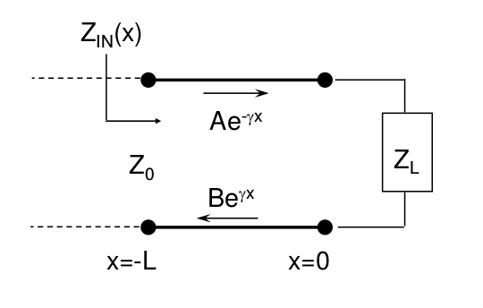

# Linhas e Transmissão

Métrica da linha                           Expressão                                                                                                                     Simplificação
-----------------------------   ---------------------------------------------------------------------------------------------------------------------------   ---------------------------------------------
Onda de tensão                     $V(x) = Ae^{-\gamma x} + Be^{\gamma x}$
Onda de corrente                   $I(x) = \frac{A}{Z_0}e^{-\gamma x} + \frac{B}{Z_0}e^{\gamma x}$
Impedância característica          $Z_0 = \sqrt{\frac{R + j\omega L}{G + j\omega C}}$                                                                           $R = 0, G = 0 \implies Z_0 = \frac{L}{C}$
Constante de propagação            $\gamma = \alpha + j\beta$
Coeficiente de ...                 $\Gamma = \frac{Be^{j\gamma x}}{Ae^{-\gamma x}} = \frac{B}{a}e^{2\gamma x}$                                                  $\Gamma(x) = \Gamma_0 e^{2\gamma x} = \Gamma (0)e^{2\gamma x}$ 
Impedância de entrada              $Z_{IN}(x) = \frac{V(x)}{I(x)} = Z_0 \frac{e^{\gamma x} + \Gamma_0 e^{\gamma x}}{e^{\gamma x} - \Gamma_0 e^{\gamma x}}$      $Z_{IN}(0) = Z_L = Z_0 \frac{1 + \Gamma_0}{1 - \Gamma_0}$ 
Coeficiente de ...                 $\Gamma_0 = \frac{Z_L - Z_0}{Z_L + Z_0}$

Em grande parte da cadeira vamos assumir que não existe atenuação

Exemplos de linhas de transmissão:

- Bifilar
- Coplanar
- Coaxial
- Microstrip

# Microondas
- frequência(f): 1 GHz $\approx$ 300 GHz
- comprimento de onda($\lambda$): 30 cm $\approx$ 1 mm

# Radiofrequência (RF)
- Em RF usam-se fontes de potência
- Se tiver uma fonte de tensão, determino a potência pela resistência interna da fonte
- Os cabos não são meros fios de ligação:
	- possuem uma determinada resistividade $\implies$ ressitência parasita
	- Sofrem de efeito indutivo
	- e efeito capacitivo
	- Também é preciso ter em consideração a disrupção do dielétrico
	- Os circuitos têm **sempre** de ser vistos como **modelos de elementos distribuidos**
	- OS parâmetros passam a ser distribuidos pela linha
		- R/m
		- C/m
		- L/m
		- G/m

Valores típicos de linhas $Z_0$: 

- $75 \Omega$ - antenas de televisão
- $50 \Omega$ - material de laboratório

A impedância característica do ar é $Z_{0_{ar}} = 120 \pi$

# Efeito Pelicular
À medida que a frequência aumenta a zona do metal onde se propaga a corrente diminui. Este fenómeno ocorre devido ao efeito de autoindução do metal, no qual o campo magnético no seu interior se cancela, aumentando, fazendo que a onda de corrente circule preferencialmente na periferia, criando uma distribuição não-uniforme da densidade de corrente ao longo do condutor

$$\delta = \frac{1}{2\pi}\sqrt{\frac{\rho}{f\mu_r}}$$

Para evitar, devo libertar dos elementos discretos sempre que possível. Limites:

- Resistências _through hole_: 10 MHZ máx
- Resistências SMD  1 GHz máx
	- 0.8, 0.5
	- 0.6, 0.3

# Componentes Passivos a altas frequências

## Resistências
- Deixam de seguir a lei de Ohm
- Possuem condensadores em paralelo e bobines em série para representar as indutâncias e capacidades parasitas resultantes da sua construção

## Bobines
- O modelo equivalente é uma bobine com uma resistência em série, em paralelo com um condensador
- Para uma dada frequência o circuito RLC formado com a indutância e capacidade parasita possui um máximo $\implies$ **frequência de ressonância**
	$$f_R = \frac{1}{2\pi \sqrt{LC}}$$
	- Onde L é dado por:
	$$L = \frac{r^2n^2}{22.9l + 25.4r} (\mu H)$$
	- e onde:
		- `r`: raio da bobine (cm)
		- `l`: comprimento da bobine (cm)
		- `n`: número de voltas da bobine 
- O fator de qualidade do filtro produzido pode ser dado por $Q = \frac{X_L}{R} = \frac{2\pi f_R L}{R} = \frac{1}{R}\sqrt{\frac{L}{C}}$, onde $X_L$ é a reatância do condensador
- Para frequências superiores à frequência de ressonância, a capacidade parasita domina e a bobine passa a ter comportamento capacitivo

	
## Condensadores
- Para altas frequências, um condensador pode ser descrito por um circuito RLC série.
- A frequência de ressonância é dada por:
	$$f_R = \frac{1}{2\pi \sqrt{LC}}$$
	- Onde a capacidade de um condensador de placas paralelas é dada por:
	$$C=\frac{\epsilon_{dielectric}A}{d}$$
	- `A`: área da superfície sobreposta
	- `d`: distância entre as placas
- O fator de qualidade do filtro produzido pode ser dado por $Q = \frac{X_C}{R} = \frac{1}{2\pi f_R RC} = \frac{1}{R}\sqrt{\frac{L}{C}}$, onde $X_C$ é a reatância do condensador
- Para frequências superiores à frequência de ressonância, a indutância parasita domina e o condensador passa a ter comportamento indutivo

