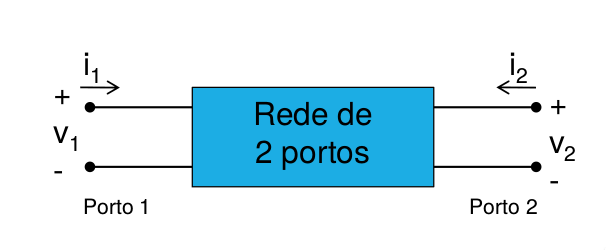

# Quadripolos
> Aquilo que um network analyzer faz é medir quadripolos

- Se os portos forem recíprocos: $$X_{ij} = X_{ji}$$
- Se os portos não tiveram perdas: $$Re \{Z_{mn}\} = 0$$

## Baixa frequência

### Matriz Impedâncias

$$\begin{bmatrix} v_1 \\ v_2 \end{bmatrix} = \begin{bmatrix} Z_{11} & Z_{12} \\ Z_{21} & Z_{22} \end{bmatrix} \begin{bmatrix} i_1 \\ i_2 \end{bmatrix} $$

$$\implies \begin{cases} v_1 = z_{11} i_1 + z_{12} i_2 \\ v_2 = z_{21} i_1 + z_{22} i_2 \end{cases} $$

Com o circuito aberto nos outros portos

$$Z_{ij} = \frac{V_i}{I_j}|_{I_{k = 0 for k \neq j}}$$

__TODO__ Inserir exemplo de uma T port network

### Matriz Admitãncias

$$\begin{bmatrix} i_1 \\ i_2 \end{bmatrix} = \begin{bmatrix} Y_{11} & Y_{12} \\ Y_{21} & Y_{22} \end{bmatrix} \begin{bmatrix} v_1 \\ v_2 \end{bmatrix} $$

$$\implies \begin{cases} i_1 = y_{11} v_1 + y_{12} v_2 \\ i_2 = y_{21} v_1 + y_{22} v_2 \end{cases} $$

Com curto-circuito nos outros portos

$$Y_{ij} = \frac{I_i}{V_j}|_{V_{k = 0 for k \neq j}}$$

$$[Y] = [Z]^{-1}$$

### Matriz Parâmetros Híbridos

$$\begin{bmatrix} v_1 \\ i_2 \end{bmatrix} = \begin{bmatrix} h_{11} & h_{12} \\ h_{21} & h_{22} \end{bmatrix} \begin{bmatrix} i_1 \\ v_2 \end{bmatrix} $$

$$\implies \begin{cases} v_1 = h_{11} i_1 + h_{12} v_2 \\ i_2 = h_{21} i_1 + h_{22} v_2 \end{cases} $$

### Matriz Parâmetros ABCD/Transmissão

$$\begin{bmatrix} v_1 \\ i_1 \end{bmatrix} = \begin{bmatrix} A & B \\ C & D \end{bmatrix} \begin{bmatrix} v_2 \\ -i_2 \end{bmatrix} $$

$$\implies \begin{cases} v_1 = A\cdot v_1 - b\cdot i_2 \\ i_1 = C\cdot v_2 - D\cdot i_2 \end{cases} $$

__TODO__ Inserir casos típicos

## Parãmeros S
- Em vez de abrir/curto-icrcuito as saídas, vou **adaptá-las**
	- É difícil obter curtos-circuitos ou circuitos abertos a alta-frequências:
		- Num comprimento de $\frac{\lambda}{4}$ posso ter um curto circuito e um circuito aberto
	- Não posso curto cicuitar a sáida porque:
	- Não tenho exatidão para saber onde está o circuito aberto
	- Mesmo que soubesse, nada me garante que conseguia medir os parâmetros nesse ponto
- Baseados em parâmetros de onda e não exlcusivamente em tensões e correntes
	- Assumo que existe uma onda incidente e uma onda refletida.
	- Ao adaptar o porto, não tenho reflexões e posso calcular os parâmetros
	- Parâmetros S\leftarrow$ _Scattering Parameters_
- A tensão em cada ponto da linha é $V = V^+(x) + V^-(x)$
	- $V^+(x) = Ae^{-\gamma x}$
	- $V^-(x) = Be^{\gamma x}$
- A corrente: $I = I^+(x) + I^-(x) = \frac{V^+(x)}{Z_0} + \frac{V^-(x)}{Z_0}$
- $

As ondas em `a` e `b` **não são ondas de tensão** porque estão normalizadas para $\sqrt{Z_0}$. O `a` e `b` representam uma **pseudo onda de potência**

$a^2 \implies$ uma unidade de potência. É um artefacto matemático.

Posso calcular as perdas por readação. Return loss

$P = V I^* = aa^* - bb^*$

$S_11$ Coeficiente de reflexão do porto 1.

## Associação de quadripolos
- Série: Somam-se os parâmetros das matrizes Impedância
- Paralelo: Somam-se os parâmetros das matrizes Admitância
- Cascata: Multiplicam-se os parâmetos das matrizes Transmissão

